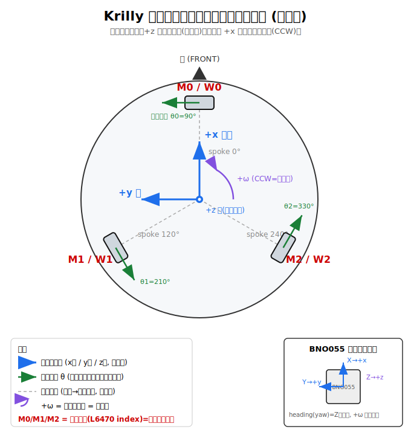

# 座標系・車体・センサー・ホイールの定義

Krilly（3輪オムニ・ホロノミック）の**車体座標系**と、**ホイール/モーター番号**、
**BNO055 センサーの取り付け向き**の関係を定義する。運動学（M2 `kinematics/kiwi.py`）・
自己位置推定（M3）はすべてこの規約に従う。



## 1. 車体座標系（body frame）

右手系。ROS REP-103 に準拠。

| 軸 | 向き |
|---|---|
| **+x** | 前方（ロボットの進行方向・正面） |
| **+y** | 左 |
| **+z** | 上（上面図では紙面手前） |
| **+ω** | +z 周りの回転 = **反時計回り(CCW) = 左旋回** |

- 角度はすべて **+x から反時計回り**に測る。
- 「前」は +x 方向。上面図では上を前として描く。

## 2. ホイール / モーター番号

各ホイールは**スポーク角（中心から見た位置角）**と**駆動方向角 θ（正回転で接地点が
進む向き）**を持つ。θ はスポーク角 + 90°（接線・CCW 向き）。
`config/robot.yaml` の `wheel_angles_deg` は**この駆動方向角 θ**である。

| 番号 | スポーク角(位置) | 駆動方向角 θ | 車体上の位置 |
|---|---|---|---|
| **M0 / W0** | 0°   | **90°**  | 前方中央 |
| **M1 / W1** | 120° | **210°** | 後方左 |
| **M2 / W2** | 240° | **330°** | 後方右 |

- 左右対称：M1(後左) と M2(後右) は前後軸(+x)について鏡像。M0 は正面。
- **`config/robot.yaml` の `wheel_angles_deg` には「スポーク角」列 `[0, 120, 240]` を入れる**
  （運動学の式が θ にスポーク角を取るため。駆動方向 = スポーク角 + 90° = [90, 210, 330]）。
- 3輪とも正回転（正の速度）で接地点が CCW 接線方向（駆動方向）に進む → 車体は **+ω（左旋回）**。

## 3. 逆運動学プレビュー（M2 で実装）

ボディ速度 `(vx, vy, ω)` から各ホイールの周速 `v_i`（`θ_i` は**スポーク角** `[0,120,240]`）：

```
v_i = -sin(θ_i)·vx + cos(θ_i)·vy + L·ω
```
（`(-sinθ_i, cosθ_i)` は駆動方向 = スポーク角+90° の単位ベクトル）

- `L` = 中心から接地点までの距離（`config/robot.yaml` の `center_to_wheel_m`、要実測）。
- 例：純前進 `vx>0` → `v0=0, v1=-0.87vx, v2=+0.87vx`（前輪 M0 は前進に寄与せず後2輪が押す）。
- 例：純横移動 `vy>0` → `v0=+vy, v1=-0.5vy, v2=-0.5vy`。
- 例：純旋回 `ω>0` → `v0=v1=v2=L·ω`（3輪同速正回転で左旋回）。

周速 → ステッパ速度の変換は `kinematics/kiwi.py`（M2）で `wheel_speed_to_step_hz`
（L6470 Run 用の**フルステップ/s**）を用いる。

## 4. モータードライバ（L6470）との対応

- **L6470 デバイス index i ＝ モーター Mi ＝ ホイール Wi**（i=0,1,2）。
- デイジーチェーン（`hal/l6470_chain.py`）は index0 が Pi の MOSI に最も近い配線
  （`mosi_is_index0=True`）。**M0→M1→M2 の順に SDO→次段SDI を繋ぐ**こと。
  逆順に配線した場合は `L6470Chain(..., mosi_is_index0=False)` で対応。

## 5. BNO055（9軸センサー）の取り付け向き

融合済みの絶対方位（heading/yaw）とジャイロを車体座標に一致させるため、
**センサー軸を車体軸に合わせて取り付ける**：

| BNO055 軸 | 合わせる車体軸 |
|---|---|
| X | +x（前方） |
| Y | +y（左） |
| Z | +z（上） |

- **heading(yaw) は Z 軸周り**の回転。上記取り付けなら、heading の増加方向が
  車体の **+ω（CCW=左旋回）と同符号**になる。
- ジャイロ **z 軸レート** が `+ω`（旋回角速度）に対応。M3 の姿勢推定はこれを主に使う。
- 物理的にこの向きに取り付けられない場合は、BNO055 の `AXIS_MAP_CONFIG` /
  `AXIS_MAP_SIGN` レジスタで軸を再マップする（現ドライバは未設定＝取り付けを
  合わせる前提）。

## 6. 前提・未確定事項（要確認）

- **前方/車輪角度**：✅ 実機で校正済み（#11）。`wheel_angles_deg` には**スポーク角**
  `[0,120,240]` を入れる（式が θ にスポーク角を取るため）。当初 config に駆動方向角
  `[90,210,330]` を入れていて並進が 90° ずれていたのを、`drive_demo` で
  +x=前進 / +y=左 / +ω=CCW になることを確認して修正済み。物理配置（M0 前・M1 後左・
  M2 後右）と本書の図は正しい。
- **`L`（center_to_wheel_m）**：現状 config は暫定値。M2 のキャリブレーションで確定。
- **BNO055 heading の実符号**：実機で `sys` 校正が上がった後に、左旋回で heading が
  期待どおり増減するかを確認する（必要なら符号/AXIS_MAP で調整）。
